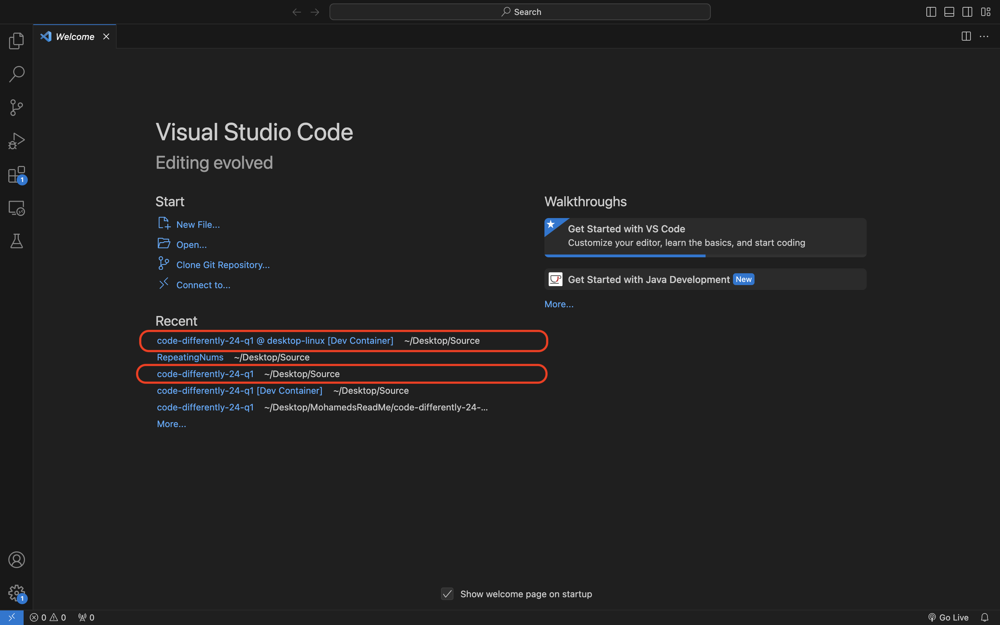
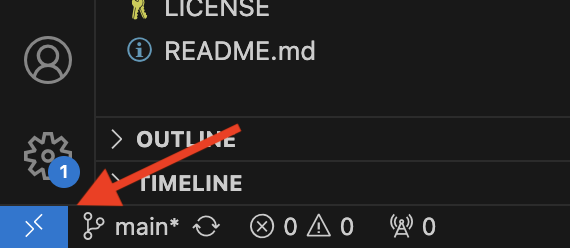
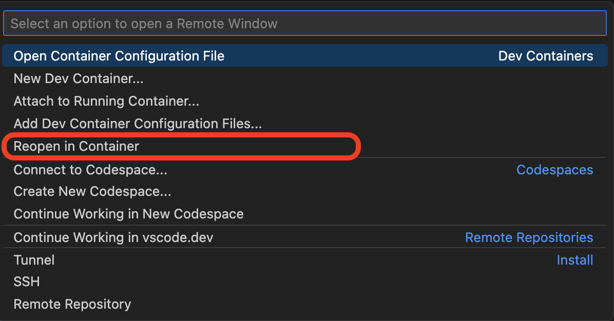
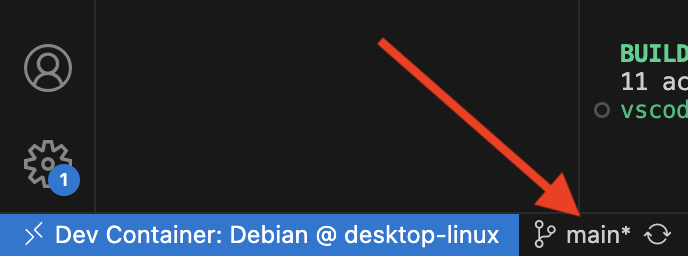
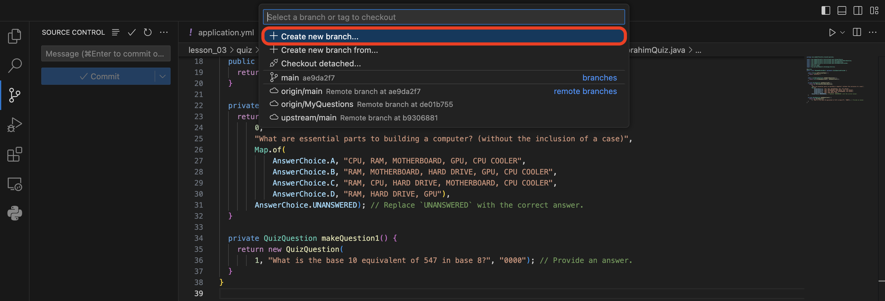
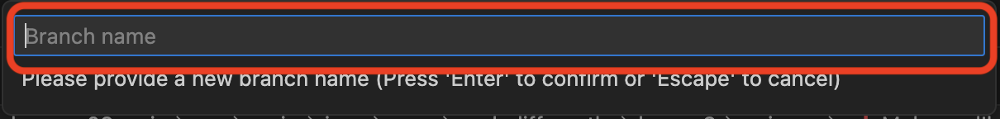
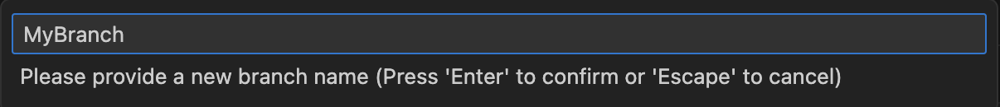
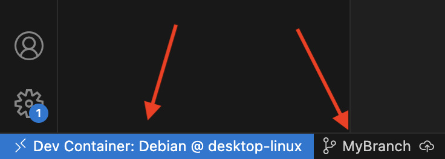

## Using Git in VS Code
In this guide I will tell you how you, yes you could use git through VS code making your life significantly easier than before. Am I saying you will never have to use console technically as far as VS code is concerned yes with pushing and pulling. You do not have to use console except when you would need to roll back after pushing changes, let’s get started.

### Step 1
Open VS Code
###Step 2 
Locate your local repo or if you have already opened the repo before with or without using a Dev Container you can find it in a list of 5 items below the section labeled recently opened. If you re opened a Dev Container repo you opened before skip to Step 5.

### Step 3
After opening a repo look in the bottom left of VS code and click on the icon that looks like the image below.

### Step 4
After clicking the icon, a drop down menu should open in the top middle of the screen. Once you locate the menu click re-open in Dev Container. (As a side note ensure that docker is running in the background. If it's not running the Dev Container will not open.)

### Step 5
To ensure Dev Container is running properly look back at the bottom left corner of VS code where the icon was, and it should look like the picture below.

### Step 6
After checking you are in Dev Container and locating the file you want to make changes to you can start looking for the Source Control icon as seen below.

### Step 7
On top of ensuring you locate Source Control you also need to make sure you are on the correct branch, or if you dont have a branch how you could make one. To tell if you are on the correct branch you can navagate back down to the bottom left of VS code and look right next to the blue Dev container information. If it says main you are in the wrong branch.

#### Below will be the image guide with some text to making a new branch
1. Click on where it displays the current branch name in the bottom left. Afterwards another drop down menu will open and you will click on create new branch. (If you are looking to just change branches you can select from existing branches from the same drop down.)

2. Next you would put in a branch name and hit enter as shown below.

3. Ensure you are on the correct branch by looking the the bottom left corner again and it should look similar to the image below.

4. Finally if you are on the Source Control Tab it should look like the image below. (You can choose to publish the branch now or latter either is fine.)

	

### Step 8
Start making changes what ever changes you need to make.
### Step 9
After making your changes navigate to the Source Control tab and it will probably look a little like the image below.

Now I know this looks like a lot of stuff. Probably a lot more stuff than what you remember changing. The reason a lot of these files change is due to how the Dev Container works, its constantly modifying the file and changing values for it to work and it is imparative that you only choose the items you want to commit. But first you have to locate them in this list.

Now you are ready for the next step.

### Step 10
Now that you have figured out which files you wanted to commit it's time to stage them. You can stage an item by hovering over the name of the icon with your mouse and you should be able to see a "+". Once you see that + you can click on it and then it would be staged. With that if you stage an item that you did not mean to stage in the staged items section you hover over the name of the item you want to remove and after that there should be a "-" sign that on click would unstage your item.below are images of them being staged, the + sign, and the - sign.

### Step 11 
Next step is commiting, in the Source Control section you can also commit your changes. First you have to enter in a commit message and then click commit. As shown in the images below. 

### Step 12
After commiting there will be a new section that will appear right below the changes section called Outgoing with the name of the branch that is receiving the commits. In the case you commit something that you do not want to commit you can undo the last commit with the three dots at the top of the Source control menu on the right, next to the refresh sign. The image below will show how the new section would look in the Source Control tab.

### Step 13
If you have published your branch. The final step you have on making changes to your GitHub repo is to push these changes and to do so you must navigate to the circle with an arrow pointing up when the name of your branch is highlighted under outgoing as shown below.

### Step 14
After you tried to bush you got a message that looks like the image below. 

To work around this you will click ok as shown in the image above and a dropdown menu in the top middle with appear to add an orgin. Will click on your Forked repop and then it will commit thoes changes the menu looks like the image below.

### Extra Step
In the case that you do not update your git repos often you can update the repo by clicking the sign below to do a pull, fetch, and push.

	
